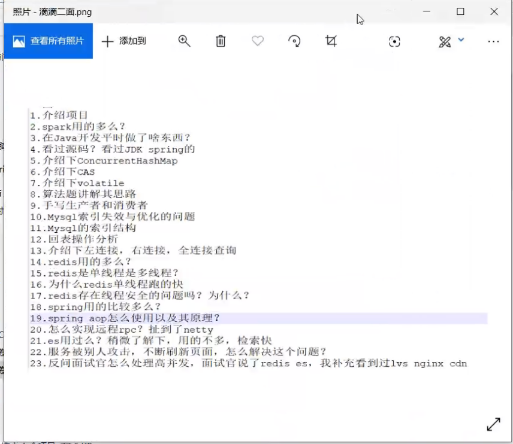

golang4javaer.md

go.pptx

Go的中文api文档：https://studygolang.com/pkgdoc

Go中文社区网站：https://studygolang.com/

## go和java的区别？

指针

GPM

1、函数重载

Go上不允许函数重载，必须具有方法和函数的唯一名称。java允许函数重载。

2、速度

go的速度比java快

3、多态

Java默认允许多态。而，Go没有。

4、路由配置

Go语言使用HTTP协议进行路由配置；而
java使用Akka.routing.ConsistentHashingRouter和Akka.routing.ScatterGatherFirstCompletedRouter进行路由配置。

5、可扩展性

Go代码可以自动扩展到多个核心；而，Java并不总是具有足够的可扩展性。

6、继承

Go语言的继承通过匿名组合完成：基类以Struct的方式定义，子类只需要把基类作为成员放在子类的定义中，支持多继承。

## go和c/c++的区别？

无指针运算

## 为什么协程快？

不快，并不比线程池（netty>go）

有些情况比线程快

## 完全等同于线程池的任务？

线程池的task，不具备协调能力

golang中可以用channel来做协程协调（在用户空间模拟了cpu切换）

## go怎么实现异步？

go没有异步，用go关键字实现异步的功能

## go调优？

调线程数

